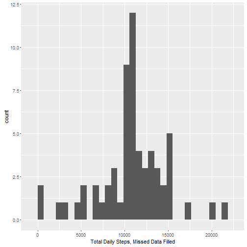

###Introduction

This project analyzes data from a personal activity monitoring device, such as a Fitbit, Nike Fuelband, or Jawbone Up. The data consists of two months of data from an anonymous individual collected during the months of October and November, 2012 and include the number of steps taken in 5 minute intervals each day.


### Data

The data for this assignment was downloaded from:

https://d396qusza40orc.cloudfront.net/repdata%2Fdata%2Factivity.zip

The variables included in this dataset are:

* steps: Number of steps taking in a 5-minute interval (missing values are coded as NA)
* date: The date on which the measurement was taken in YYYY-MM-DD format
* interval: Identifier for the 5-minute interval in which measurement was taken

The dataset was a comma-separated-value (CSV) file and there were a total of 17,568 observations in the dataset. It was downloaded, unzipped and read into a data.frame and processed using the following code:

```r
#download and unzip file
if(!file.exists("activity.zip")) {
        temp <- tempfile()
        download.file("https://d396qusza40orc.cloudfront.net/repdata%2Fdata%2Factivity.zip",temp)
        file <- unzip(temp)
        unlink(temp)
}
```


```r
#turn off scientific notation output (i.e., you want 1061 not 0.1061^4)
options(scipen=999)
#Load the data
dt <- read.csv("activity.csv", header=T, stringsAsFactors=FALSE)
#Convert date from char to a date variable
dt$date <- as.Date(dt$date, format="%Y-%m-%d") 
#convert intervals to date/time format and create a new variable intervaldt - this will show the interval in hours (50 = 00:50)
dt$intervaldt <- as.POSIXct(strptime(paste(dt$date,sprintf("%04d",as.numeric(dt$interval))),"%Y-%m-%d %H%M"))
```


### What is mean total number of steps taken per day?

This section will report the total and average number of steps take by the individual, ignoring the missing values.


```r
#Calculate the total number of steps taken per day
library(dplyr)  #load dplyr
daily_steps <- dt %>% group_by(date) %>% summarize(sumsteps = sum(steps))
library(ggplot2)        #load ggplot2
#Make a histogram of the total number of steps taken each day, but don't print
p1<- ggplot(data=daily_steps, aes(sumsteps)) + geom_histogram() + xlab("Total Daily Steps, Missing Data Ignored")
#Calculate the mean and median of the total number of steps taken per day
meansteps=round(mean(daily_steps$sumsteps, na.rm=TRUE),2)
mediansteps=round(median(daily_steps$sumsteps, na.rm=TRUE),2)
```

Below is a histogram of the total number of steps take each day.


The individual's average daily total steps,ignoring missing values, was 10766.19.
The individual's median daily total steps,ignoring missing values, was 10765.


### What is the average daily activity pattern?

This section will report a time series plot of the 5-minute interval and the average number of steps taken, averaged across all days, as well as report which 5-minute interval, on average across all the days in the dataset, contains the maximum number of steps.


```r
#this uses the date/time interval to compute mean steps for each 5 minute interval
time_steps <- dt %>% group_by(interval, intervalt=strftime(intervaldt, format="%H:%M:%S")) %>% summarise(mean = mean(steps, na.rm=TRUE))
# make a timeseries plot (this uses time interval in H:M instead of the provided intervals and provides for better display), but don't print
p2<- ggplot(data=time_steps,aes(x=as.POSIXct(strptime(time_steps$intervalt,format="%H:%M:%S"), tz="GMT"),y=mean))+xlab("Interval") + ylab("Mean number of steps across all observed days") + ggtitle("Average Number of Steps Over 24 Hours")+geom_line()+scale_x_datetime(date_labels="%H:%M")+ theme(plot.title=element_text(face="bold"))
#Compute the max of steps
MaxStep<-time_steps[which(time_steps$mean == max(time_steps$mean)), ]
```

The time-series plot below shows the average total steps taken by the individual over a 24-hour period:


Time interval 08:35:00, contains the maximum number of steps (206.17), on average across all the days in the dataset.


### Imputing missing values

The data has a number of days/intervals where there are missing values (coded as NA). This section imputes missing values to see if the presence of missing days may introduce bias into some calculations or summaries of the data.

There are 2304 missing values (of steps) in the dataset.

When a value is missing, it was filled with the mean for the 5-minute interval (across all days).  This was created by adding a new variable "stepsfilled" to the original dataset.


```r
#copy steps to stepsfilled (including all the missing values - NAs)
dt$stepsfilled <-dt$steps
#Get the vector of intervals with missing steps
steps.na<-dt$interval[is.na(dt$steps)]
#Get corresponding location of x in time_steps
index <-sapply(steps.na, function(x) which(time_steps$interval == x))
#Replace NA values with corresponding values in time_steps
dt$stepsfilled[is.na(dt$steps)]<-time_steps$mean[index]
```

With this new data, histogram, mean and median are computed to assess the impact of imputation on missing data.


```r
#compute sum of steps for each day
daily_stepsfilled <- dt %>% group_by(date) %>% summarize(sumstepsfilled = sum(stepsfilled))
#Make a histogram, but don't print
p3<-ggplot(data=daily_stepsfilled, aes(sumstepsfilled)) + geom_histogram() + xlab("Total Daily Steps, Missed Data Filled")
#compute mean and median
meanstepsfilled=round(mean(daily_stepsfilled$sumstepsfilled, na.rm=TRUE),2)
medianstepsfilled=round(median(daily_stepsfilled$sumstepsfilled, na.rm=TRUE),2)
```

Below is a histogram of the total number of steps take each day, similar to the previous histrogram, but with missing values filled in with mean of known values for each interval.



The individual's average daily total steps, with the new dataset, was 10766.19.
The individual's median daily total steps, with the new dataset, was 10766.19.

*Comparing the two histograms, mean and median values, we see that the frequency in the middle of the distribution has increased due to the additional values, but other than that we don't see significant changes to daily total activity mean or median.*


```r
#this uses the date/time interval to compute mean steps for each 5 minute interval
time_stepsfilled <- dt %>% group_by(interval, intervalt=strftime(intervaldt, format="%H:%M:%S")) %>% summarise(mean = mean(stepsfilled, na.rm=TRUE))
# this creates a time-series graph, but doesn't print
p4<- ggplot(data=time_stepsfilled,aes(x=as.POSIXct(strptime(time_stepsfilled$intervalt,format="%H:%M:%S"), tz="GMT"),y=mean))+xlab("Interval") + ylab("Mean number of steps across all observed days") + ggtitle("Average Number of Steps Over 24 Hours")+geom_line()+scale_x_datetime(date_labels="%H:%M")+ theme(plot.title=element_text(face="bold"))
```

The time-series plot below shows the average total steps taken by the individual over a 24-hour period, using the new dataset:


*Again, comparing the two time-series plots, we don't see significant changes to average daily activity using mean as an imputing strategy for filling missing information.*


### Are there differences in activity patterns between weekdays and weekends?

In this last section, differences in activity patterns between weekdays and weekends will be assessed and compared.

```r
#Creates a new factor variable in the dataset with two levels - "weekday" and "weekend" indicating whether a given date is a weekday or weekend day.
##assume workday and weekday as followed in the United States
Wkdays <- c('Monday', 'Tuesday', 'Wednesday', 'Thursday', 'Friday')
#convert to `factor` and specify the `levels/labels`
dt$wkday <- factor((weekdays(as.Date(dt$date)) %in% Wkdays),levels=c(FALSE, TRUE), labels=c('weekend', 'weekday'))

#group data by weekdays and weekend
time_stepsfilled <- dt %>% group_by(wkday, interval, intervalt=strftime(intervaldt, format="%H:%M:%S")) %>% summarise(mean = mean(stepsfilled, na.rm=TRUE))
#create a two panel time-series plot, but don't print
p5<- ggplot(data=time_stepsfilled,aes(x=as.POSIXct(strptime(time_stepsfilled$intervalt,format="%H:%M:%S"), tz="GMT"),y=mean))+xlab("Interval") + ylab("Mean number of steps across all observed days") + ggtitle("Average Number of Steps Over 24 Hours")+geom_line()+scale_x_datetime(date_labels="%H:%M")+ theme(plot.title=element_text(face="bold"))+facet_wrap(~ wkday,ncol=1)
```

The time-series plot comparison below, using the new dataset, shows the average total steps taken by the individual over a 24-hour period across weekdays (Monday-Friday) and weekend (Saturday and Sunday):


*Comparing the two time-series plots above, it is evident that the individual's peak activity is lowered over the weekend - around 175 steps- versus roughly 225 steps during the weekdays, but there is more activity throughout the daytime (till about 18:00 hours) over the weekend.*
